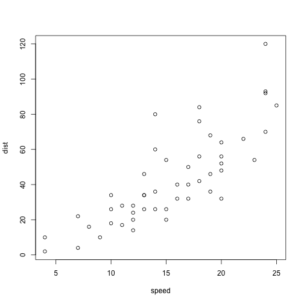

NFL Visualized Results: Game and Against the Spread
========================================================
author: Andy Rosa
date: 2014-08-21

I heard you like American Football...
========================================================

So I built you [this visualization web app](http://andylytics.shinyapps.io/nfl_data_project/) that allows you to:

- Choose any season between 2006 - 2013
- Choose whether you want to see the Game result or the Against the Spread (ATS) result
- Visualize how each team performed by week

NFL Data
========================================================

I wrote [a script](https://github.com/andylytics/nfl_results/blob/master/data_prepare.R) that uses a [nice resource for NFL data](http://www.repole.com/sun4cast/data.html) to create a 2006-2013 dataset of team performance for games and against the spread.


```r
d <- read.csv("nfldata.csv")
head(d[, c("TeamName", "Game.Result", "ATS.Result")])
```

```
             TeamName Game.Result ATS.Result
1      Miami Dolphins        Loss       Loss
2 Pittsburgh Steelers         Win        Win
3   Arizona Cardinals         Win       Loss
4     Atlanta Falcons         Win        Win
5    Baltimore Ravens         Win        Win
6       Buffalo Bills        Loss        Win
```

Use the App to Visual Team Performance!!!
========================================================

 

You can view the ATS Results as well. Enjoy!
====================

 
